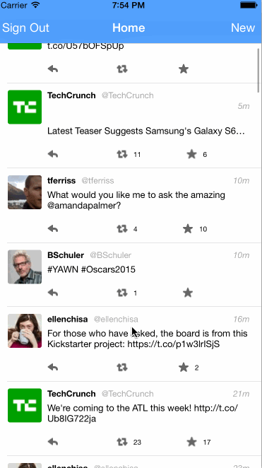
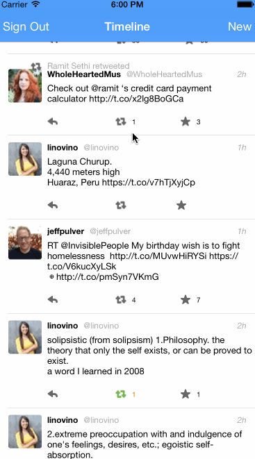

## Twitter Client for Codepath week 4

This is a basic twitter app to read and compose tweets the [Twitter API](https://apps.twitter.com/).

<<<<<<< Updated upstream
Time spent: Around 18 to 20 hours
||||||| merged common ancestors
Time spent: Around 18
=======
Time spent: 8h
>>>>>>> Stashed changes

### Features

[x] Hamburger menu
[x] Dragging anywhere in the view should reveal the menu.
[x] The menu should include links to your profile, the home timeline, and the mentions view.
[x] The menu can look similar to the LinkedIn menu below or feel free to take liberty with the UI.

[x] Profile page
[x] Contains the user header view
[x] Contains a section with the users basic stats: # tweets, # following, # followers

[x] Home Timeline
[x] Tapping on a user image should bring up that user's profile page

[ ] Optional: Account switching

###3rd party libraries used:
- SVProgressHUD
- AFNetworking
- BDBOAuth1Manager

### Walkthrough

Walkthrough of all user stories:

GIF created with [LiceCap](http://www.cockos.com/licecap/).
