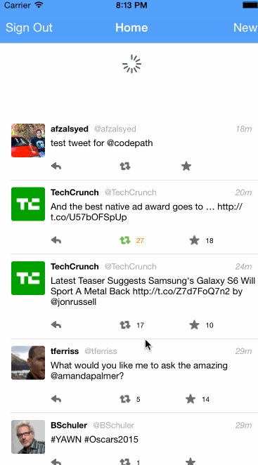

# Project: Twitter Client (week 3)

This is an iOS demo application Twitter using the [Twitter API] (https://dev.twitter.com/rest/public)

Time spent: About 18 hours

Completed user stories:

Required Stories:

[x] User can sign in using OAuth login flow
[x] User can view last 20 tweets from their home timeline
[x] The current signed in user will be persisted across restarts
[x] In the home timeline, user can view tweet with the user profile picture, username, tweet text, and timestamp. 
[x] User can pull to refresh
[x] User can compose a new tweet by tapping on a compose button.
[x] User can tap on a tweet to view it, with controls to retweet, favorite, and reply.

Optional stories: 
[ ] Optional: When composing, you should have a countdown in the upper right for the tweet limit.
[x] Optional: After creating a new tweet, a user should be able to view it in the timeline immediately without refetching the timeline from the network.
[x] Optional: Retweeting and favoriting should increment the retweet and favorite count.
[x] Optional: User should be able to unretweet and unfavorite and should decrement the retweet and favorite count.
[x] Optional: Replies should be prefixed with the username and the replyid should be set when posting the tweet,
[x] Optional: User can load more tweets once they reach the bottom of the feed using infinite loading similar to the actual Twitter client.

Notes:

The autolayout specifically setting the constraints look a long time for me

This was a great learning experience for learning authentication, setting complex models and dynamic views.

3rd party libraries used:

SVProgressHUD
AFNetworking
BDBOAuth1Manager

Walkthrough of all user stories:

GIF created with [LiceCap](http://www.cockos.com/licecap/).
